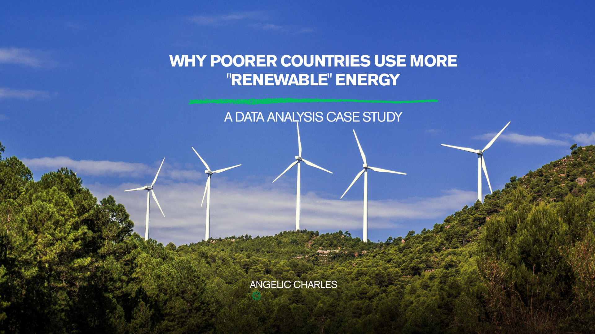
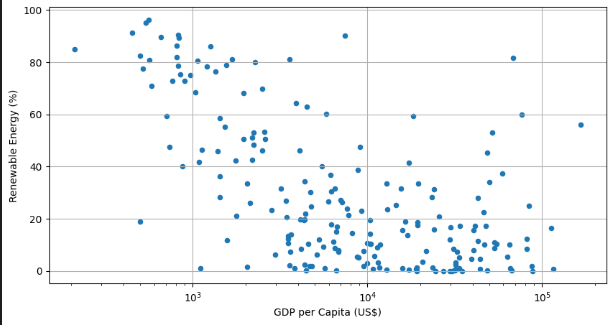
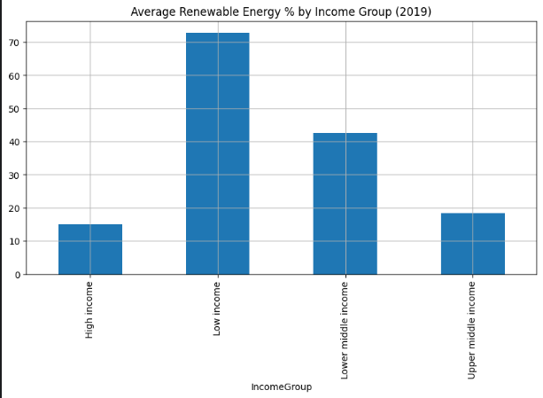

  
  <h1>🌍 Renewable Energy vs. GDP Per Capita</h1>
  <h3>A Correlation Analysis of Wealth & Sustainability</h3>

> **Hypothesis:** Do wealthier nations use more renewable energy, or do poorer nations rely on it more?
>  
> 🔗 **[Read the Full Article on Hashnode](https://nerdyalgorithm.hashnode.dev/why-poorer-countries-use-more-renewable-energy-a-data-analysis-case-study-in-solving-messy-data)**

---

## 📊 Project Overview
This project analyzes the correlation between a country's wealth (**GDP per capita**) and its commitment to renewable energy (**% of total energy use**) for the year **2019**.

Using data from the World Bank, I cleaned, merged, and analyzed datasets to determine if economic growth supports or hinders the transition to green energy.

## 🛠️ Tech Stack
* **Python:** Data manipulation and analysis.
* **Pandas:** Cleaning 70+ columns of raw World Bank data.
* **SciPy (`spearmanr`):** Calculating statistical correlation.
* **Matplotlib:** Visualizing trends via scatter plots and bar charts.

---

## 🔍 Key Findings

### 1. The Correlation
I calculated a Spearman correlation coefficient of **-0.5719** ($p < 0.05$).
* **Result:** A statistically significant, moderate **negative** correlation.
* **Meaning:** As a country's wealth increases, its percentage of renewable energy use generally *decreases*.

### 2. Visual Analysis (The "Why")
The scatter plot initially showed a confusing cluster. However, segmenting by **Income Group** revealed the truth.

  
  
   
  <i>Left: The overall negative trend.          Right: The explanation by Income Group.</i>

 

* **Low Income Nations:** High renewable usage (~73%). This is not solar/wind, but **biomass** (wood, charcoal) used for survival.
* **High Income Nations:** Lower average renewable usage (~15-18%), driven by industrialization and fossil fuel reliance.

### 3. The "Traditional Energy Divide"
The "Top 10" lists confirmed a split reality:
* **Poorest Nations** (e.g., Congo, Somalia) have >90% renewable use due to traditional biomass.
* **Wealthiest Nations** are split. Some are low (Cayman Islands: 0%), while others (Iceland, Norway) defy the trend with massive Hydro/Geothermal investments.

---

## 📝 Conclusion
The correlation is not as simple as "wealth = pollution."

The negative correlation is largely driven by a **"traditional energy divide."** The poorest nations rely on traditional renewables (biomass), while middle-income nations industrialize using fossil fuels. The wealthiest nations are currently in a transition phase—some remaining high-carbon, while others pioneer modern Green Tech.

---

## 📂 Data Sources
* **GDP Data:** World Bank (GDP per capita, current US$)
* **Renewable Data:** World Bank (Renewable energy consumption % of total final energy consumption)
